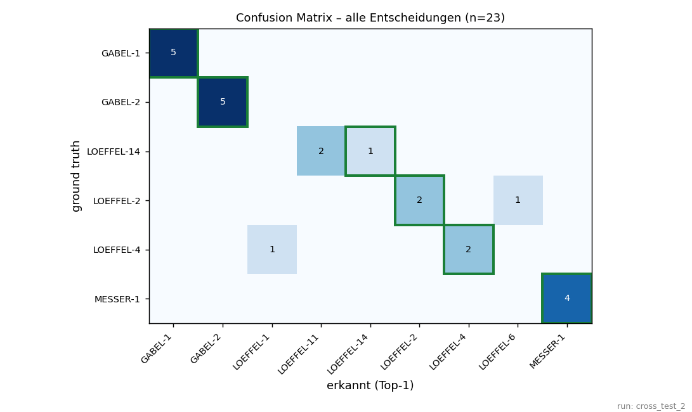
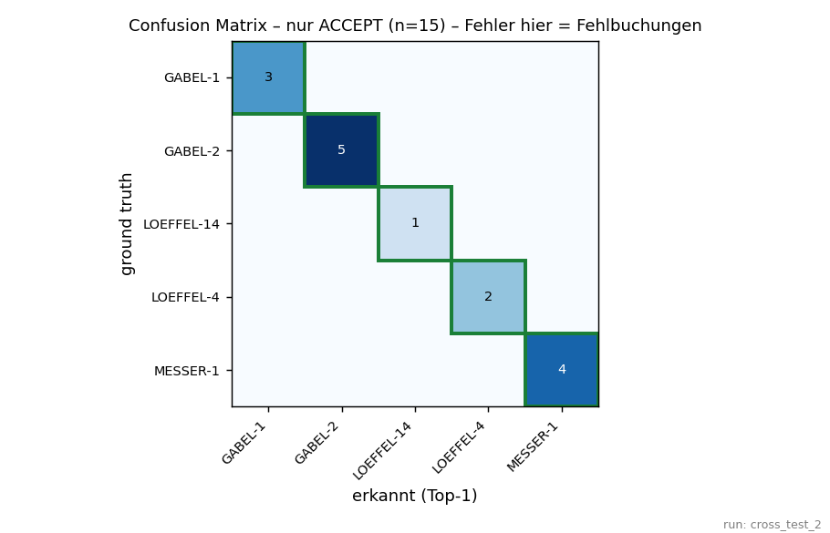
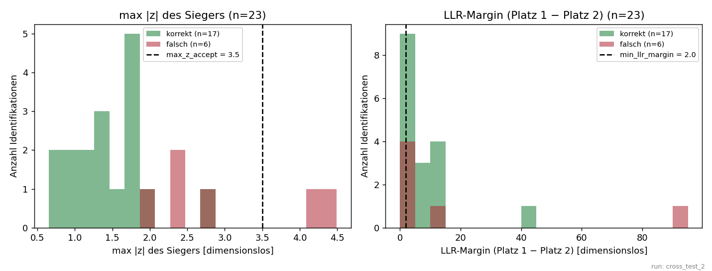
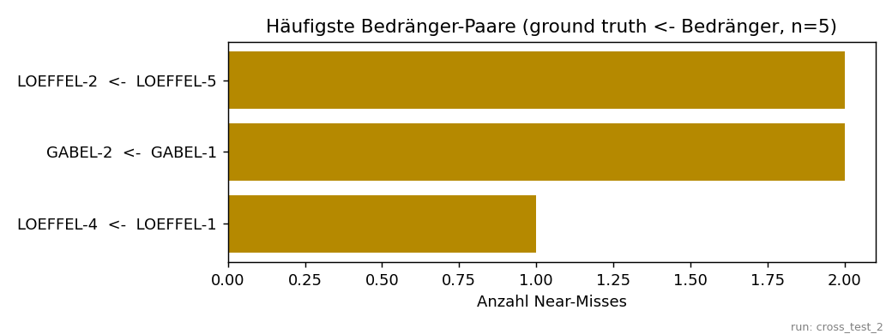
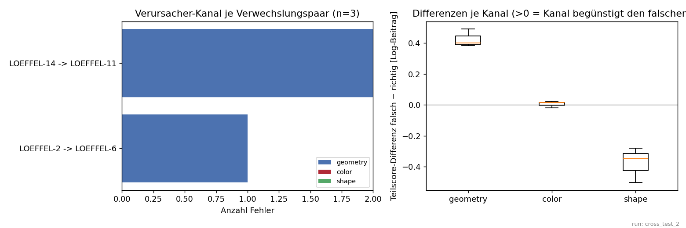
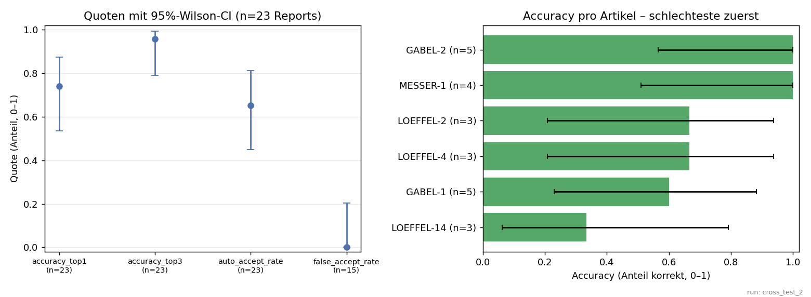

# Scoring-Analyse – Auswertungslauf

- run_id: `cross_test_2`
- erzeugt: 2026-07-23T17:49:39
- Quelle: `/Users/mikeeberharter/Documents/Doco_Detect/data/captures`
- Reports: 23 (davon bewertet/gelabelt: 23)
- Reports: 23 JSONs nach `/Users/mikeeberharter/Documents/Doco_Detect/reports/analysis/cross_test_2/reports` archiviert – der Quellordner ist bereit für die nächste Testrunde (Bilder bleiben dort liegen).

Grafiken (PNG) für den Menschen, CSV/JSON für Diffs zwischen Testläufen. Bewertungen kommen aus den Richtig/Falsch-Buttons bzw. `evaluate`-Labels.

## A) Confusion Matrix

Daten: [`confusion_matrix.csv`](confusion_matrix.csv)

Daten: [`confusion_matrix_accept.csv`](confusion_matrix_accept.csv)

## B) Score-Verteilungen (korrekt vs. falsch)

- Mapping: das frühere auto_accept_score existiert im statistischen Scoring nicht mehr – entscheidungsrelevant sind max|z| des Siegers (Gate `max_z_accept`) und die LLR-Margin (`min_llr_margin`).

Daten: [`score_distributions.csv`](score_distributions.csv)

## C) Near-Miss-Liste (korrekt, aber Margin < 2.0 × 1.5 = 3)

Daten: [`near_misses.csv`](near_misses.csv)

## D) Teilscore-Attribution bei Fehlern

- 6 als falsch bewertete Identifikationen, davon 3 attribuierbar.
- 1× der richtige Artikel hat den Geometrie-Vorfilter nicht überlebt (Toleranz bzw. Stammdaten prüfen – siehe `sync-stammdaten`).
- 2× der richtige Artikel stand auf Platz 1, die Entscheidung lautete aber reject/ambiguous – KEINE Fehlidentifikation, sondern eine Gate-/Margin-Frage; eine Teilscore-Attribution ist hier nicht anwendbar.

Daten: [`error_attribution.csv`](error_attribution.csv)

Daten: [`error_attribution_unattributed.csv`](error_attribution_unattributed.csv)

## E) Positionsplot (Ø-Messfehler über die Bildposition)

- Kein gelabelter Fall mit Soll-Ø in der Datenbank.

Daten: [`position_errors.csv`](position_errors.csv)

## F) Quoten mit Wilson-Konfidenzintervallen

Daten: [`metrics.json`](metrics.json)
